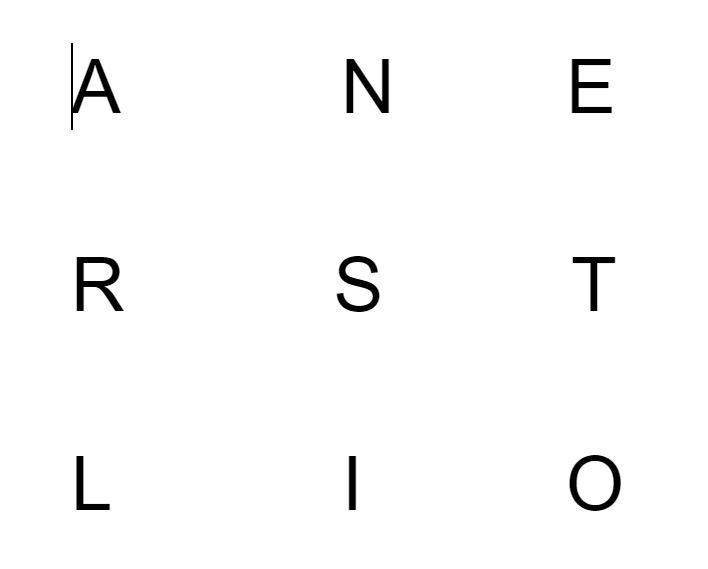
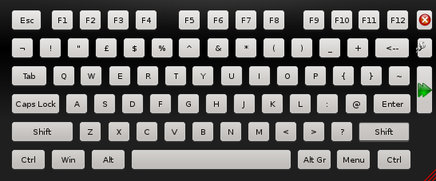
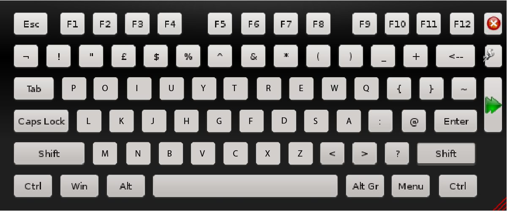

# Eye Typing In-Class Exercise

## Activity 1: Warm Up

1. View the image listed below. (When completing the eye-typing/ guessing, enlarge the keyboards so that they take up the entire size of the screen.)

2. Turn on your camera
3. Designate one student as “typist” and the other as “guesser.”  These roles will switch after the first round.
4. Perform a “calibration” to see what it looks like when each partner looks at the letters.
5. One student will use their eyes to “type” using the letters on the document and the other will say what letter they think the typist is looking at it.  If the guesser guesses   the wrong letter, the typist should blink (an exaggerated blink so it’s obvious).  The guesser should indicate in their notes that they missed the letter.  If the guesser       guesses correctly, the typist should move eyes to the next letter.  When the last letter is reached, the typist should tell the guesser that the word is finished, close         their eyes, and start the process over again.  This should be done for 1 minute, with the guesser keeping track of how many words they were able to guess correctly in that       minute and how many times they incorrectly guessed a letter.  The guesser should calculate their accuracy using this equation:
     #### *Accuracy =  {N - D - S - I } / N * 100%
     #### N: Number of symbols
     #### D: Deletions
     #### S: Substitutions
     #### I: Insertions
6. Swap roles and repeat.
7. Submit words per minute and accuracy score in qualtrics form.

### Qualtrics Questions
1. What was your wpm?
2. What was your accuracy rate?

## Activity 2: Fastest Saccades

1. Open the link to the virtual clock
    https://www.online-stopwatch.com/large-online-clock/
2. Assign one student as typist and one as counter.  These roles will switch after the first round.
3. The typist will look back and forth between the 12 and the 2 for 10 seconds (the time it takes for the second hand to travel from the 12 to the 2), so it is best to wait          until the second hand reaches the 12 to begin.  The counter will keep track of how many times the typist looks back and forth at the numbers.  The counter will tell the          typist their number of saccades and the typist should report this number in the qualtrics form.  The typist will also report on the qualtrics form their level of eye            fatigue and any other comments they’d like to leave.  
4. Swap roles and repeat.

### Qualtrics Questions
1. What was your fastest saccades rate?
2. What was your level of fatigue after the 10 seconds?
3. Additional Comments:

## Activity 3: Full QWERTY

1. View the images below.  (When completing the eye-typing/ guessing, enlarge the keyboards so that they take up the entire size of the screen.)

2. Decide who will be the typist and who will be the guesser.  Roles will switch at the end of the round.  
3. The typist will “type” words with their eyes using the keyboard opened up on their screen.  The guesser will guess which word the typist is looking at, and much like in Activity 1, if the guesser guesses correctly the typist moves to the next letter, and if they guess incorrectly, the typist should blink and the guesser should tally this and guess again.  At the end of one minute the guess should calculate their words per minute and their accuracy and indicate it in the qualtrics.  Also, complete the NASA TLX form on the qualtrics.  
4. Swap roles and repeat.

### Qualtrics Questions
1. What was your words per minute?
2. What was your accuracy rate?
3. Complete the NASA TLX.

