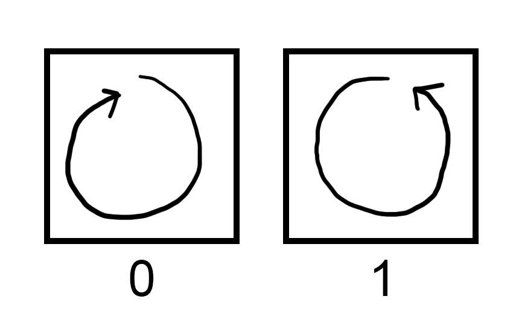
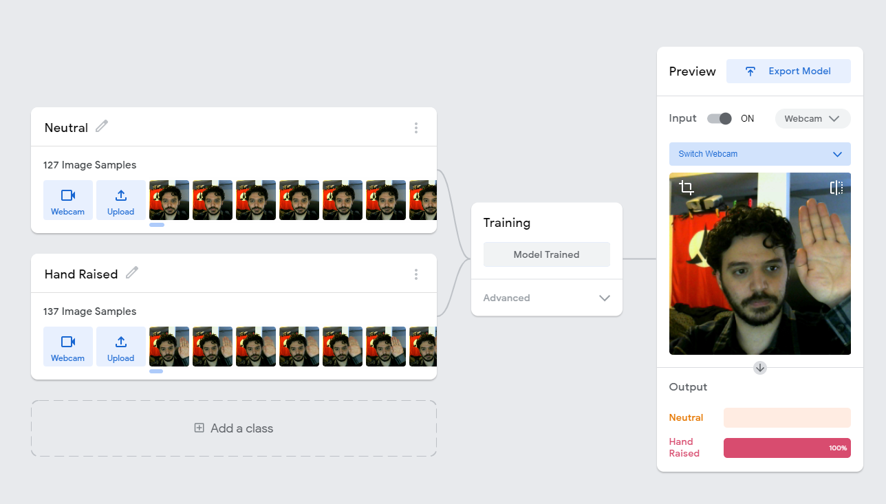

# Gestures In-Class Exercise

## Motion Gestures Activity

### Recognition Warm-up
In this exercise, you will use hand gestures to transmit a binary string. For this exercise, you will use clockwise and anticlockwise circles to represent the bits 0 and 1 respectively, using a closed fist as a separator. For example, in the gif below, the participant is gesturing a clockwise circle, then an anticlockwise circle, then a clockwise circle indicating the binary string "010". Note that the number of times that the participant circles their finger is irrelevant - the separator fist gesture indicates the end of a single character.

 

Please follow these steps to complete the warm-up:
1. Choose one partner to be the *gesturer* and one partner to be the *reader*.
2. Have the *gesturer* perform a few test symbols, so that both parties understand what each symbol will look like on camera. Bear in mind that if you are conducting this exercise over the internet that your video conferencing service may be mirroring the video.
3. *Gesturer*, use [this site](http://www.unit-conversion.info/texttools/random-string-generator/#data) to generate a random 16-bit binary string.
    * Set "Allowed chars" to "01"
    * Set "Length" to 16
    * Press "Generate"
4. *Gesturer*, silently use video chat to transmit your string to the reader. Be sure to use a closed fist to separate one bit from another.
5. *Reader*, watch the gesturer and write down the sequence of 0's and 1's. Do not indicate to the *gesturer* what you think they were trying to transmit, nor tell them when you are ready for the next gesture. Just take down the sequence as they sign it as best as you can.
6. Now, compare the sequence that the reader recognized with the binary string that the gesturer was trying to transmit. Calculate your accuracy by 100% * (N - D - S - I) / N, where N is number of symbols (16), D is the number of deletions, S is the number of substitutions, and I is the number of insertions needed to get from the string received to the intended string.
    * Alternately, you can use [this tool](http://www.unit-conversion.info/texttools/levenshtein-distance/#data) to calculate the [Levenshtein distance](https://www.wikiwand.com/en/Levenshtein_distance) between the two strings, which will give you L = (D + S + I). So you can calculate the accuracy as 100% * (N - L) / N * 100%.
7. Repeat this process, with the participants swapping roles.

### Gesture Design
Imagine that you are on the design team for a new digital assistant device. Your boss wants users to be able to have the assistant perform ten common tasks by performing a hand gesture to the camera. **The camera for this digital assistant can only perform one-point tracking - that is, it can detect the position on the screen of the tip of one index finger, and that's it.** You may still use a separator gesture like a closed fist.

1. Both partners should draw ten squares on a piece of paper and label each of them with the digits 0 through 9.
2. Collaboratively develop a gesture to represent each digit, and draw it in the box as an arrow indicating the path of the tip of the finger through space.
3. Choose one partner to be the *gesturer* and one partner to be the *reader*.
4. As before, perform each symbol and establish what they look like, resolving any screen mirroring issues.
5. *Gesturer*, use [this site](http://www.unit-conversion.info/texttools/random-string-generator/#data) to generate a random 16-bit decimal string.
    * Set "Allowed chars" to "0123456789"
    * Set "Length" to 16
    * Press "Generate"
6. *Gesturer*, silently use video chat to transmit your string to the reader. Be sure to use a closed fist to separate one bit from another.
7. *Reader*, watch the gesturer and write down the sequence of 0's and 1's. Do not indicate to the *gesturer* what you think they were trying to transmit, nor tell them when you are ready for the next gesture. Just take down the sequence as they sign it as best as you can.
8. Now, compare the sequence that the reader recognized with the binary string that the gesturer was trying to transmit. Calculate your accuracy by 100% * (N - D - S - I) / N, where N is number of symbols (16), D is the number of deletions, S is the number of substitutions, and I is the number of insertions needed to get from the string received to the intended string.
    * Alternately, you can use [this tool](http://www.unit-conversion.info/texttools/levenshtein-distance/#data) to calculate the [Levenshtein distance](https://www.wikiwand.com/en/Levenshtein_distance) between the two strings, which will give you L = (D + S + I). So you can calculate the accuracy as 100% * (N - L) / N * 100%.
9. Repeat steps 4-8 with the roles reversed.

### Qualtrics Questions
* How accurate were you in entering the given **two** symbols?
* How accurate were you in entering the given **ten** symbols?
* As we discussed in the previous lectures, Don Norman emphasized 7 design principles (discoverability, feedback, conceptual model, affordance, signifier, mapping, and constraints) for interface design.  Please choose two of the design principles and evaluate whether the gesture interface would succeed or fail.
* Please briefly describe how you would design a study to evaluate the usability and learnability of the command gestures that you invented. Be sure to indicate what you expect you would learn from the study and justify why the study would yield that information.

## Sign Language Training Activity
Google's teachable machine is a website where you can quickly perform supervised machine learning to identify images, sounds, or poses from the browser. For this project, you will attempt to teach it sign language.

### Learning Teachable Machine
First, you'll need to learn to use Teachable Machine. You will start by teaching it to identify whether your hand is raised.

1. Go to the [Teachable Machine Image Training](https://teachablemachine.withgoogle.com/train/image) page.
2. You'll see that by default it populates the model with two classes. Rename the classes to "Neutral" and "Hand Raised".
3. Press the "webcam" button in the "Neutral" class to use your webcam to add image samples. Then, maintain a neutral pose and hold the "hold to record" button to record images of yourself not raising your hand. Be sure to move around a bit to give it an idea of multiple different poses you might take while not raising your hand. You'll want to take at least 100 images.
4. Repeat step 3 in the "Hand Raised" class, but use the webcam to create images of you with your hand raised.
5. In the "Training" bubble, press "Train Model". Don't worry about any of the advanced settings. Wait until it's done training.
6. When it's done training, it should automatically start previewing the model. Under "output" you can see its guess as to the probability that you are or are not raising your hand.

Once you're done, your screen should look something like the following screenshot. (Pay no attention to the Klingon flag in the background.)

It's usually quite accurate, but keep in mind that the teachable machine is very dependent on conditions staying relatively similar. If you move significantly closer or farther away from your webcam or change shirts, the model will likely stop working, and you'll have to retrain.

### Sign Language Activity
Imagine you've been given the task of making a gestural interface that interprets sign language letters as commands. You will be using teachable machine to make a prototype. Imagine that in order to input the appropriate command, the system must recognize the user holding the symbol for two seconds.

1. Start a new [Teachable Machine Image Training](https://teachablemachine.withgoogle.com/train/image) project.
2. Make 4 classes named "Neutral", "A", "B", and "C".
3. Train each of the four classes in the same way as in the learning exercise. For the "neutral" class, make sure that it gets a variety of images of you not signing. For the A, B, and C classes, make sure that it gets plenty of images of you making the signs from different angles and with the hand in different positions on the screen.
4. Train the model, and test it out. Try and get it to correctly identify each of the 4 classes. You will likely have to watch the percentages in the test window and maneuver your hand until it recognizes the sign.
5. Modify the system to improve recognition. Remember that the goal is for the user to be able to get the recognizer to identify the correct sign for 2 seconds with a minimum of effort. You can modify what the camera can see, the environment, or the signs themselves. Retrain the model and evaluate your success.

### Qualtrics Questions
* What did you change about the system to increase ease of identification, and how do you think that this change would affect usability for a native sign language speaker?
* In testing, you were able to always see the AI's predictions for what sign it thought it was looking at in the form of the percentages at the bottom of the screen. Describe the effect to usability if these percentages were not visible in the final product.
* As we discussed in the previous lectures, Don Norman emphasized 7 design principles (discoverability, feedback, conceptual model, affordance, signifier, mapping, and constraints) for interface design.  Please choose two of the design principles and evaluate whether the gesture interface would succeed or fail.
* Please briefly describe how you would design a study to evaluate the usability and learnability of the command gestures that you invented. Be sure to indicate what you expect you would learn from the study and justify why the study would yield that information.
