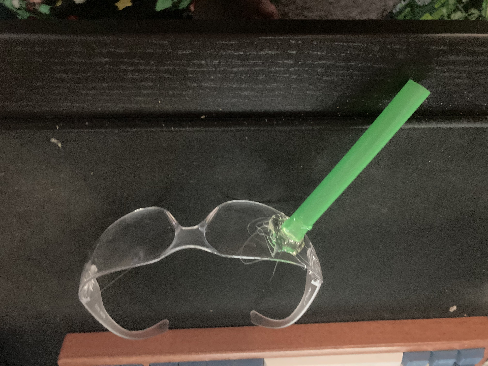

# Head Mounted Display Exercise (~55-70 minutes)

## Activity 1: Display Location Exploration (~35-45 minutes)

1. For this exercise student will need these materials
	- Safety glasses
	- 2 straws about1/2 inch in diameter
	- Hot glue gun
	- Scissors
	- Rubbing alcohol (soap and warm water can work)
	- A partner (in person or online)

2. To begin the exercise student will cut a length of straw to about 2 inches. They will then glue it on the safety glasses where they think a head worn display should located.

3. Once it is glued in place, the student should wear the glasses with he straw on there for about 4 to 5 minutes to get used to it being in their field of view and become more comfortable with it. 

4. Once the time has passed, the students should write there person a sentence on a piece of paper (or message if online) and have them hold it up to where they are reading it through the straw.

5. The student should then take notes of the experience while wearing the glasses and how it was to actually read something with the display in the current location.

6. This should be done 2-3 time on each lens to have a full understand of how different display locations will effect usability.

7. After the exercise in complete the students should fill out a NASA TLX scale https://humansystems.arc.nasa.gov/groups/tlx/downloads/TLXScale.pdf

## Activity 2: Eyebox Exploration (~20-25 minutes)

1. Here the process is similar to the previous activity but we are looking at the eyebox of a head worn display and not the location in the field of view.

2. The student will choose their favorite position from previous part of the activity and attach about 5 inches of straw there. This is a much longer straw so a lot of glue is required

3. Here the student will where the glasses for about 2-3 minutes before reading the note from their partner. 

4. During this time they should take notes on the experience but focus more on field of view and how much you can see in the display versus how much the display blocks from vision.
5. Repeat these steps but cut of an an inch from the straw each time until you are left with only about an inch left.
6. After this the same NASA TLX from above will be used to judge the experience.

### Qualtrics Questions

1. What length of the straw was your ideal eyebox? (in inches)
2. What length of straw was the worst eyebox for you? (in inches)
